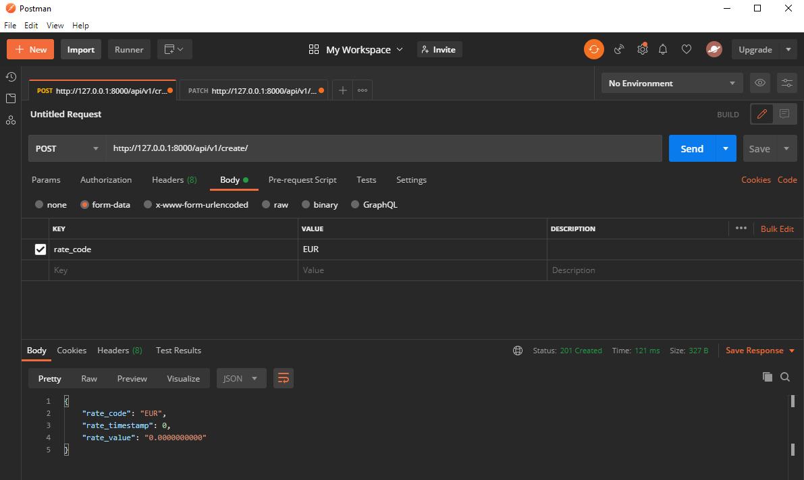

# Exam Project Banking System - Django Elective Course 

This document is created with the purpose of presenting a walkthrough for the application, built using the Django framework. Ultimately, the scope is demonstrating our acquired knowledge during the course as well as the relevance of the system by presenting a few of the many different features which follow industry standards and Django recommended patterns. The system is split into several different applications to have a clear separation of concerns and to avoid bloating the code base.

## Technologies

- Django 3.1.6
- Python 3.8.5

## Features

The focus while implementing different features was meeting the requirements provided. Here, however, we will only tackle a few of them to provide an overview.

- The customers are able to authenticate through either signing up or logging in, after which they are welcomed with the Dashboard view. Of course, when signing up they have the option of adding a phone number which serves well for multi-factor authentication. 


- They can have multiple accounts and view their ranking, either "Basic", "Silver" or "Gold" in conformity with the bank's policy.


- Customers can interact with the system by either making transactions if they have a sufficient account balance, applying for a loan ( provided they are ranked "Gold" ), paying a loan, while altogether being able to view their account movements.


- Bank employees have their own designated authentication system and they can view accounts, edit and update data, create new customers and new accounts for them.


- The multi-factor authentication feature works in conjunction with the Duo Mobile application.


- The customer can contact employees with different inquiries ( e.g. applying for a status change in order to be eligible for a loan ) through the power of Django Channels.


- The API with its several routes can assist the customer with updated currencies, rates and a conversion feature. The process of updating the data is executed through making use of Django's Task Queues which are combined Celery.

```
urlpatterns = [

    path('symbols/', SymbolList.as_view()),

    path('latest/', CurrencyList.as_view()),

    path('latest/<str:currency_code>/', api_currency_detail, name="detail"),

    path('rates/', RateList.as_view()),

    path('create/', api_rate_historical_post, name="create"),

    path('update/<str:currency_code>/', api_currency_update, name="edit"),

    path('rates/<str:rate_code>/', api_rate),

    path('rates/<str:rate_code>/<int:rate_from>/', api_rate_historical_from),

    path('rates/<str:rate_code>/<int:rate_from>/<int:rate_to>/', api_rate_historical_range),

    path('convert/<str:rate_code_from>/<str:rate_code_to>/<int:amount>/', api_convert),

]
```


- The middleware filters the access of users to the bank employee feature view through the IP address currently set to the classic 127.0.0.1. If changed to another IP it will generate a 403 error.

```
 def __call__(self, request):
    
      allowed_ip_addresses = '127.0.0.1'
      private_paths = settings.PRIVATE_PATHS['ONLY_FOR_EMPLOYEES']
      employee_ip = request.META.get('REMOTE_ADDR')
      requested_path = request.path
      print(f'** client ip address: {employee_ip}')
      if employee_ip != allowed_ip_addresses and requested_path in private_paths:
         raise PermissionDenied()
         print('cannot continue')
```


- Lastly, it can assist the developer through Postman to create or update records and with a provided REST Documentation:




## Extra Features

These ought to be relevant to the bank and are represented by the aforementioned API conversion ability and the additional view upon updated API currencies in the Dashboard.
